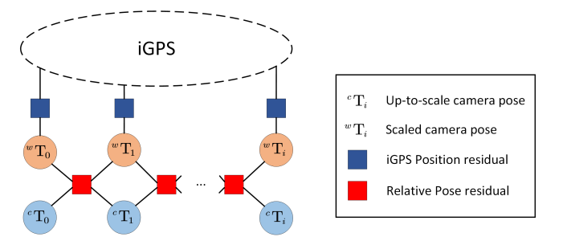

## iGPS-MonoSLAM: An A SLAM System Optimally Combining iGPS and Monocular Odometry
# 1. Contribution
1. The first Visual-iGPS tightly-coupled SLAM system, which optimizes iGPS and Monocular Visual-SLAM jointly, reached a millimeter (mm) level of localization.
2. A novel Multiview-Alignment-based method of spatial calibration is proposed to calculate the relationship between iGPS and the camera.
3. An online temporal offset calibration algorithm based on a constant motion model.
4. The Global Localization is enabled by pose-graph optimization and Global Bundle Adjustment with loop closure, which optimal combinates iGPS and camera.



# 2. Prerequisites
We have tested the library in **Ubuntu 16.04** and **18.04**, but it should be easy to compile in other platforms. A powerful computer (e.g. i7) will ensure real-time performance and provide more stable and accurate results.

## C++11 or C++0x Compiler
We use the new thread and chrono functionalities of C++11.

## Pangolin
We use [Pangolin](https://github.com/stevenlovegrove/Pangolin) for visualization and user interface. Dowload and install instructions can be found at: https://github.com/stevenlovegrove/Pangolin.

## OpenCV
We use [OpenCV](http://opencv.org) to manipulate images and features. Dowload and install instructions can be found at: http://opencv.org. **Required at leat 3.0. Tested with OpenCV 3.2.0 and 4.4.0**.

## Eigen3
Required by g2o (see below). Download and install instructions can be found at: http://eigen.tuxfamily.org. **Required at least 3.1.0**.

## DBoW2 and g2o (Included in Thirdparty folder)
We use modified versions of the [DBoW2](https://github.com/dorian3d/DBoW2) library to perform place recognition and [g2o](https://github.com/RainerKuemmerle/g2o) library to perform non-linear optimizations. Both modified libraries (which are BSD) are included in the *Thirdparty* folder.

## Python
Required to calculate the alignment of the trajectory with the ground truth. **Required Numpy module**.

* (deb) `sudo apt install libpython2.7-dev`, often installed when finish system installation

# 3. Building iGPS-MonoSLAM library and examples

Clone the repository:
```
git clone https://github.com/LeonGoretzkatju/iGPS-MonoSLAM
```

```
cd iGPS-MonoSLAM
chmod +x build.sh
./build.sh
```
# 4. iGPS-MonoSLAM Running Example
```
./Monocular/mono_euroc ../Vocabulary/ORBvoc.txt ./Monocular/EuRoC.yaml your_dataset_path
```

